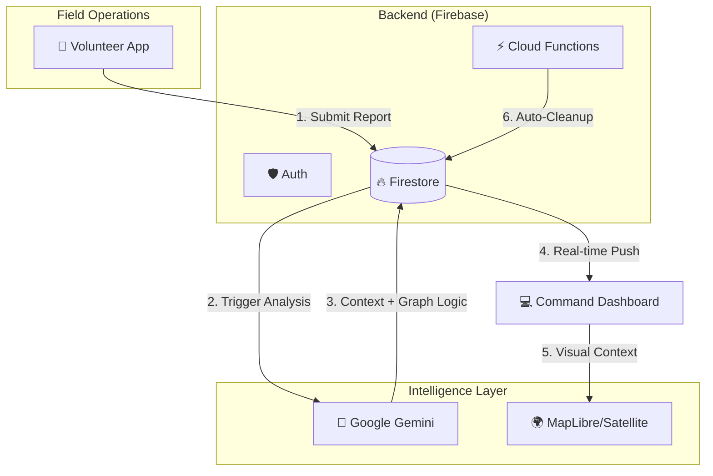

# 🚨 Aftermath AI — Crowd Incident Management System


> **"From Chaos to Command."**
> An intelligent, real-time operational dashboard for managing large-scale crowd incidents, powered by Graph Algorithms and Multimodal AI.

---

## 📖 Overview

Large-scale public events (festivals, pilgrimages, protests) suffer from a critical **"Cognitive Bottleneck."** When a crush or panic occurs, human operators are overwhelmed by noise, preventing fast decision-making.

**Aftermath AI** solves this by turning field volunteers into "Human Sensors" and using **Google Gemini** as a "Digital Incident Commander." It doesn't just display data; it actively analyzes risk, calculates evacuation paths via a graph network, and issues tactical orders.

### 🎥 Demo
*<Yet to be inserted>*

---

## ⚡ Key Features

### 🧠 Intelligent Command (AI & Logic)
* **Multimodal Analysis:** Uses **Google Gemini 2.5 Flash** to analyze crowd density, image evidence, and unstructured text notes simultaneously.
* **Graph-Based Pathfinding:** The system models the venue as a connected graph (Nodes/Edges). It runs a BFS (Breadth-First Search) algorithm to identify valid evacuation routes dynamically.
* **Context-Aware Orders:** The AI doesn't just say "High Risk." It outputs specific, actionable commands (e.g., *"Close Gate A, divert flow to Medical Point B via Route 2"*).

### 📱 Volunteer Interface (Field Ops)
* **"Panic-Free" UX:** A high-contrast, distraction-free interface designed for high-stress environments.
* **Resilient Reporting:** Supports image capture and rapid density scoring.
* **Dither Aesthetic:** Uses WebGL-based dithering for a unique, battery-efficient visual style.

### 💻 Admin Dashboard (Command Center)
* **Live Geospatial Map:** Integration with **MapLibre** and **Satellite Imagery** to visualize the venue.
* **Dynamic Waypoint Linking:** Admins can draw event boundaries and link waypoints (creating the graph structure) directly on the map.
* **Priority Queue:** Critical incidents are visually prioritized; low-level noise is suppressed.
* **Audit Logging:** Every AI suggestion and human action is logged in Firestore for accountability.

---

## 🏗️ Technical Architecture

The system follows a **Serverless Event-Driven Architecture**:



### Tech Stack

* **Frontend:** React (Vite), TypeScript, Tailwind CSS, Framer Motion.
* **Maps:** MapLibre GL JS, ArcGIS World Imagery.
* **Backend:** Firebase (Auth, Firestore, Cloud Functions).
* **AI Engine:** Google Gemini API (via Google GenAI SDK).

---

## 🚀 Getting Started

### Prerequisites

* Node.js (v18+)
* Firebase Project
* Google Cloud API Key (for Gemini)

### Installation

1. **Clone the Repo**
```bash
git clone [https://github.com/agalzh/aftermath-ai.git](https://github.com/agalzh/aftermath-ai.git)
cd aftermath-ai

```


2. **Install Dependencies**
```bash
npm install

```


3. **Environment Setup**
Create a `.env` file in the root directory:
```env
VITE_GEMINI_API_KEY=your_google_gemini_key
VITE_FIREBASE_API_KEY=your_firebase_key
# ... other firebase config keys

```


4. **Run Development Server**
```bash
npm run dev

```


---

## 🧠 AI Implementation Details

We utilize **Prompt Engineering** and **Graph Context Injection** to make Gemini operational.

**The Prompt Strategy:**
Instead of asking "What is happening?", we inject the **Graph Topology** into the prompt:

> *"Verified Evacuation Routes: [Gate A -> Path B], [Stage -> Exit C]"*

This forces the LLM to ground its advice in physical reality, preventing hallucinations and ensuring evacuation orders are actually executable.

**Safety Protocols:**

* **Keyword Escalation:** Client-side logic checks for words like "Crush" or "Fire" to override AI latency if necessary.
* **Human-in-the-Loop:** AI generates the *draft* order; the Admin must explicitly click "Send."

---

## 🔮 Future Roadmap

* **TensorFlow Integration:** Migrate from static graph rules to RL (Reinforcement Learning) agents that predict congestion before it happens.
* **IoT Mesh Network:** Enable offline communication via LoRaWAN for volunteers in dead zones.
* **Computer Vision:** Automated density counting using live CCTV feeds via Vertex AI Vision.

---

## 👥 Contributor

* **[Nikil PS]** - Individual member of GrayFrame

---

> Built for **InnovHack 2025** @ SASTRA University.

```

